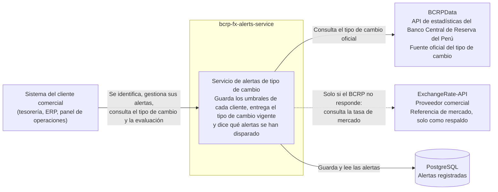
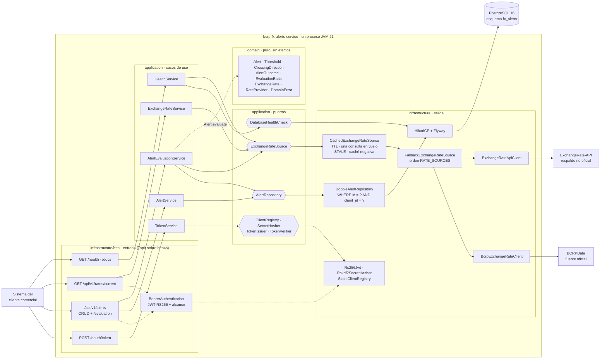

# bcrp-fx-alerts-service

Servicio backend para clientes comerciales de un banco que necesitan reaccionar al tipo de cambio
sol/dólar. Cada cliente registra **alertas** ("avísame si el dólar supera S/ 3.85") y el servicio
entrega el **tipo de cambio vigente** con su procedencia y **evalúa** las alertas del cliente
contra él, diciendo cuáles se han disparado y sobre qué dato.

El dato oficial procede de [BCRPData](https://estadisticas.bcrp.gob.pe/estadisticas/series/ayuda/api),
la API de estadísticas del Banco Central de Reserva del Perú (serie `PD04640PD`, tipo de cambio
venta del sistema bancario elaborado por la SBS). Como esa API está detrás de un WAF que bloquea de
forma intermitente a los clientes no interactivos, el servicio incorpora una fuente de respaldo
**no oficial** y hace explícito, en cada respuesta, sobre qué dato está operando.

Construido en Scala 3 sobre la JVM 21 con http4s, Tapir, doobie, circe, ciris y Flyway;
PostgreSQL 16 como base de datos. Sin dependencias fuera del JDK para la criptografía.

## Contenido

1. [Arquitectura](#arquitectura)
2. [Puesta en marcha](#puesta-en-marcha)
3. [Contrato de la API](#contrato-de-la-api)
4. [Comportamiento clave](#comportamiento-clave)
5. [Decisiones de arquitectura](#decisiones-de-arquitectura)
6. [Pruebas](#pruebas)
7. [Limitaciones conocidas y siguientes pasos](#limitaciones-conocidas-y-siguientes-pasos)
8. [Estructura del repositorio](#estructura-del-repositorio)

## Arquitectura

### Nivel 1 — Contexto

Quién usa el servicio y de qué depende.



- Los **clientes comerciales** son sistemas, no personas: se autentican máquina a máquina y cada
  uno ve únicamente sus alertas.
- El **BCRP** es la única fuente oficial. **ExchangeRate-API** solo interviene cuando el BCRP no
  responde, y el servicio nunca presenta sus datos como oficiales.
- **PostgreSQL** guarda las alertas. El tipo de cambio no se persiste: se obtiene, se guarda en
  memoria un tiempo y se evalúa en el momento.

### Nivel 2 — Contenedores y componentes

Un único proceso JVM organizado en tres capas con dirección de dependencia estricta
(`infrastructure → application → domain`). Los hexágonos son los **puertos**: las interfaces que la
aplicación define y la infraestructura implementa.



Cómo leerlo:

- **`infrastructure/http`**: cada endpoint es una definición Tapir de la que se derivan a la vez
  las rutas http4s y el documento OpenAPI (Swagger UI en `/docs`). La seguridad forma parte de la
  definición de cada endpoint protegido (`BearerAuthentication`), no es un middleware aparte. Todo
  error se responde como Problem Details (RFC 7807) y cada petición lleva `X-Request-Id`.
- **`application`**: los casos de uso orquestan puertos y delegan las reglas al dominio. No saben
  nada de HTTP, SQL ni JSON.
- **`domain`**: tipos con invariantes (`Threshold`, `ClientId`), la regla de cruce
  (`Alert.evaluate`) y la procedencia del dato (`RateProvider`). Sin efectos ni dependencias.
- **`infrastructure` de salida**: la consulta del tipo de cambio es una pila de decoradores sobre
  el mismo puerto: caché → cadena de fuentes → cliente de cada fuente → política común de llamada
  remota (`RemoteCall`: tiempos de espera, reintentos, registro). El repositorio acota toda
  consulta por cliente propietario en el propio SQL.
- **`Main`** es el único lugar que conoce las implementaciones concretas y las compone.

## Puesta en marcha

### Requisitos

- JDK 21 (LTS)
- [sbt](https://www.scala-sbt.org/) 1.x (el script `sbt` descarga la versión fijada en `project/build.properties`)
- Docker y Docker Compose v2
- OpenSSL (en Windows viene con Git Bash) para generar el par de claves

### Pasos

1. **Crear el archivo de entorno** a partir de la plantilla:

   ```bash
   cp .env.example .env
   ```

   Ninguna credencial está en el código ni en archivos versionados; `.env` y los `.pem` están
   ignorados por git. `.env.example` documenta cada variable con su valor por defecto.

2. **Generar el par de claves RSA** con el que se firman los tokens y volcarlo en `.env` (una sola
   línea con `\n` literales, entre comillas simples). Desde Git Bash o cualquier shell POSIX:

   ```bash
   openssl genpkey -algorithm RSA -pkeyopt rsa_keygen_bits:2048 -out jwt-private.pem
   openssl pkey -in jwt-private.pem -pubout -out jwt-public.pem
   printf "JWT_PRIVATE_KEY='%s'\n" "$(awk 'NF { printf "%s\\n", $0 }' jwt-private.pem)" >> .env
   printf "JWT_PUBLIC_KEY='%s'\n"  "$(awk 'NF { printf "%s\\n", $0 }' jwt-public.pem)"  >> .env
   ```

   Borra antes las líneas `JWT_PRIVATE_KEY=` / `JWT_PUBLIC_KEY=` de ejemplo. `JWT_PUBLIC_KEY` es
   opcional (se deriva de la privada). Sin `JWT_PRIVATE_KEY` el servicio se niega a arrancar:
   nunca genera una clave efímera por su cuenta.

3. **Registrar al menos un cliente** en `OAUTH_CLIENTS`. La utilidad genera un secreto aleatorio
   (que se entrega al cliente y no vuelve a mostrarse) y su hash, que es lo único que el servicio
   guarda:

   ```bash
   sbt "runMain pe.quiroz.fxalerts.infrastructure.security.ClientSecretTool"
   ```

   ```
   OAUTH_CLIENTS=cliente-001|pbkdf2-sha256:600000:<sal>:<hash>|alerts:read,alerts:write,rates:read
   ```

4. **Levantar PostgreSQL**:

   ```bash
   docker compose up -d --wait
   ```

   Si el puerto 5432 está ocupado, cambia `DB_PORT` en `.env`; `docker-compose.yml` lo respeta.

5. **Exportar las variables y arrancar** (sbt no lee `.env` por sí mismo):

   ```bash
   # bash / zsh
   set -a; source .env; set +a
   sbt run
   ```

   ```powershell
   # PowerShell
   Get-Content .env | Where-Object { $_ -match '^\s*[^#]' } | ForEach-Object {
     $name, $value = $_ -split '=', 2
     [Environment]::SetEnvironmentVariable($name.Trim(), $value.Trim().Trim("'"))
   }
   sbt run
   ```

   Al arrancar, la aplicación valida las claves y el registro de clientes, ejecuta las migraciones
   de Flyway y queda escuchando en `http://localhost:8080`.

6. **Verificar**:

   - `GET http://localhost:8080/health` → `{"status":"UP","database":{"status":"UP"},"rates":{...}}`
     (sin token). Si el BCRP está bloqueando en ese momento verás `DEGRADED` y
     `rates.source = "ERAPI"`: es el comportamiento esperado, no un fallo.
   - `http://localhost:8080/docs` → Swagger UI; el botón "Authorize" obtiene un token con
     `client_id` y `client_secret`.
   - La secuencia completa de peticiones, incluidos los casos de error, está en
     [`scripts/api-walkthrough.sh`](scripts/api-walkthrough.sh):

     ```bash
     CLIENT_ID=cliente-001 CLIENT_SECRET='<el secreto generado en el paso 3>' sh scripts/api-walkthrough.sh
     ```

## Contrato de la API

Documento OpenAPI en `/docs/docs.yaml` y Swagger UI en `/docs`, generados de las mismas
definiciones Tapir que atienden las peticiones: no pueden divergir de la implementación.

| Método y ruta | Alcance requerido | Qué hace | Respuestas |
|---|---|---|---|
| `GET /health` | ninguno | Estado agregado: `UP`, `DEGRADED` (200) o `DOWN` (503, solo si falla la base de datos). `rates.source` y `rates.official` dicen qué fuente sirve el tipo de cambio | 200, 503 |
| `GET /docs` | ninguno | Swagger UI y documento OpenAPI | 200 |
| `POST /oauth/token` | ninguno (credenciales de cliente) | Emite un JWT con el flujo `client_credentials`. Credenciales por HTTP Basic o en el cuerpo, nunca por ambos; `scope` opcional | 200; errores RFC 6749: 400 `invalid_request` / `unsupported_grant_type` / `invalid_scope`, 401 `invalid_client` |
| `POST /api/v1/alerts` | `alerts:write` | Registra una alerta para el cliente del token; nace activa; `Location` con su ruta | 201, 400 |
| `GET /api/v1/alerts` | `alerts:read` | Lista las alertas del cliente del token, por fecha de creación | 200 |
| `GET /api/v1/alerts/evaluation` | `alerts:read` | Evalúa todas las alertas del cliente contra el tipo de cambio vigente; devuelve el dato usado, su base (`basis`, `conclusive`) y el resultado de cada alerta | 200, 404 (sin dato publicado), 503 (ninguna fuente responde) |
| `GET /api/v1/alerts/{id}` | `alerts:read` | Una alerta propia | 200, 404 |
| `PUT /api/v1/alerts/{id}` | `alerts:write` | Reemplazo completo de la configuración (incluido `status`) | 200, 400, 404 |
| `DELETE /api/v1/alerts/{id}` | `alerts:write` | Elimina una alerta propia | 204, 404 |
| `GET /api/v1/rates/current` | `rates:read` | Último tipo de cambio de la serie de referencia, con procedencia (`source`) y frescura (`freshness`) | 200, 404, 503 |

Reglas transversales:

- Todo endpoint protegido responde **401** sin token o con token inválido (mismo cuerpo en ambos
  casos; el motivo solo va al log) y **403** con token válido pero sin el alcance exigido.
  `alerts:write` no implica `alerts:read`.
- Una alerta de **otro cliente** responde **404**, indistinguible de una inexistente.
- Los errores usan **Problem Details** (`application/problem+json`) con `type` estable
  (`urn:fx-alerts:problem:validation`, `not-found`, `unauthorized`, `forbidden`,
  `source-unavailable`, `malformed-request`, `internal`). Única excepción: `POST /oauth/token`,
  cuya forma de error la fija RFC 6749 §5.2.
- Cada respuesta lleva `X-Request-Id` (se propaga el recibido si es corto y alfanumérico; si no,
  se genera uno) y el log registra una línea por petición con ese identificador y, si el token es
  válido, `client=<client_id>`. Nunca se registran tokens, secretos ni cuerpos.

Ejemplo de alerta y de evaluación:

```json
{ "series": "PD04640PD", "threshold": 3.85, "direction": "ABOVE" }
```

```json
{
  "evaluatedAt": "2026-08-30T15:30:42Z",
  "rate": {
    "series": "PD04640PD", "value": 3.523, "date": "2026-08-28",
    "retrievedAt": "2026-08-30T15:30:00Z", "ageSeconds": 42, "freshness": "FRESH",
    "source": { "id": "BCRP", "name": "BCRPData (BCRP) - serie PD04640PD elaborada por la SBS",
                "official": true, "measures": "Tipo de cambio venta del sistema bancario ..." }
  },
  "basis": "OFFICIAL_CONFIRMED",
  "conclusive": true,
  "items": [
    { "alert": { "id": "6f1c…", "series": "PD04640PD", "threshold": 3.50, "direction": "ABOVE",
                 "status": "ACTIVE", "clientId": "cliente-001", "createdAt": "…", "updatedAt": "…" },
      "outcome": "TRIGGERED" }
  ]
}
```

## Comportamiento clave

Resumen operativo; el razonamiento de cada decisión está en los [ADR](docs/adr/README.md).

### Tipo de cambio: fuentes, caché y salud

- **Cadena de fuentes** (`RATE_SOURCES`, por defecto `BCRP,ERAPI`). Solo se pasa a la siguiente
  cuando la anterior **no pudo responder**; si una fuente responde que no hay dato publicado, esa
  respuesta se respeta.

  | Código | Fuente | Qué mide | Oficial |
  |---|---|---|---|
  | `BCRP` | BCRPData, serie diaria `PD04640PD` | Tipo de cambio **venta** del sistema bancario (SBS): precio oficial de referencia | Sí |
  | `ERAPI` | [ExchangeRate-API](https://www.exchangerate-api.com), `open.er-api.com/v6/latest/USD` | Tasa de mercado USD/PEN agregada por un proveedor comercial; referencia indicativa | No |

- **Procedencia explícita**: cada valor lleva `source { id, name, official, measures, attribution }`.
  Un consumidor distingue un precio oficial de una referencia de mercado sin conocer la
  implementación. Los datos del respaldo llevan la atribución que exige el proveedor
  ("Rates By Exchange Rate API").
- **Reintentos** (`BCRP_*`, `ERAPI_*`): solo ante fallos transitorios (tiempo de espera, fallo de
  conexión, 5xx), con espera que se duplica. Un 4xx, un cuerpo que no es el JSON esperado (la
  página de desafío del WAF) o un `"result": "error"` del proveedor no se reintentan.
- **Caché en memoria** (`BCRP_CACHE_*`, común a todas las fuentes): el dato se sirve `FRESH`
  durante el TTL (15 min); las peticiones concurrentes comparten una única consulta en vuelo; si
  al vencer ninguna fuente responde se sirve el último valor conocido como `STALE` durante como
  máximo 24 h y no se reintenta hasta pasado 1 min (si no hay valor, durante ese mismo plazo se
  responde el fallo sin reconsultar).
- **Sin dato**: `404` si la fuente responde pero no hay valor publicado en la ventana consultada
  (`BCRP_LOOKBACK_DAYS`, 7 días); `503` (`source-unavailable`) si ninguna fuente responde y no hay
  nada en caché.
- **`/health`**: `DEGRADED` (200) cuando se sirve desde el respaldo no oficial, desde caché
  obsoleta o cuando ninguna fuente responde; `DOWN` (503) solo si falla la base de datos, porque
  es lo único que justifica retirar la instancia.

Para observar el servicio sobre el respaldo basta apuntar `BCRP_BASE_URL` a un host inexistente;
para forzar el 503, además, `RATE_SOURCES=BCRP`:

```bash
BCRP_BASE_URL=http://bcrp.invalido.local/api sbt run   # 200 con source.id = ERAPI; /health DEGRADED
RATE_SOURCES=BCRP BCRP_BASE_URL=http://bcrp.invalido.local/api sbt run   # 503; /health rates DOWN
```

### Seguridad

- **OAuth 2.0 `client_credentials`** (RFC 6749 §4.4): el servicio emite los tokens en
  `POST /oauth/token` y los verifica en cada petición. `/health`, `/docs` y `/oauth/token` son los
  únicos recursos abiertos.
- **JWT RS256** con cabecera `typ: at+jwt` (RFC 9068); solo se aceptan tokens con exactamente esa
  cabecera, de modo que `alg: none` u otros algoritmos se rechazan antes de mirar la firma.
  Claims `iss`, `sub` / `client_id`, `aud`, `iat`, `exp`, `jti`, `scope`. Vida `JWT_TTL` (15 min;
  entre 1 min y 24 h); sin refresco ni revocación; tolerancia de reloj de 30 s. Clave mínima de
  2048 bits.
- **Secretos de cliente** con PBKDF2-HMAC-SHA256 (600 000 iteraciones, sal de 16 bytes),
  comparación en tiempo constante y verificación contra un hash señuelo para identificadores
  desconocidos.
- **Aislamiento por cliente**: el propietario de una alerta es siempre el `sub` del token; el
  acotamiento se aplica en la propia consulta SQL (`WHERE id = ? AND client_id = ?`).

| Situación | Respuesta |
|---|---|
| Sin token, o `Authorization` con otro esquema | `401` `urn:fx-alerts:problem:unauthorized`, `WWW-Authenticate: Bearer realm="bcrp-fx-alerts"` |
| Token mal formado, firma inválida, caducado, emisor o audiencia incorrectos | `401`, **mismo cuerpo**, `WWW-Authenticate: Bearer realm="bcrp-fx-alerts", error="invalid_token"` |
| Token válido sin el alcance exigido | `403` `urn:fx-alerts:problem:forbidden`, `WWW-Authenticate: Bearer ..., error="insufficient_scope", scope="<alcance>"` |
| Alerta de otro cliente | `404`, indistinguible de una inexistente |

### Evaluación de alertas

`GET /api/v1/alerts/evaluation` cruza el tipo de cambio vigente con **todas** las alertas del
cliente y devuelve dos dimensiones independientes:

- `outcome` por alerta: `TRIGGERED`, `NOT_TRIGGERED`, `INACTIVE` (no se evalúa) o
  `SERIES_MISMATCH` (dato de otra serie). La comparación es **estricta**: `ABOVE` dispara con
  `valor > umbral`, `BELOW` con `valor < umbral`; la igualdad no dispara en ningún sentido. La
  semántica inclusiva se expresa con el cuarto decimal del umbral (`ABOVE 3.7999` ≡ "≥ 3.800"
  sobre datos oficiales, que se publican con tres decimales).
- `basis` por evaluación (todas las alertas se evalúan contra el mismo dato): `OFFICIAL_CONFIRMED`
  (único caso con `conclusive = true`), `MARKET_REFERENCE` (respaldo no oficial) o `UNCONFIRMED`
  (dato obsoleto, ninguna fuente responde). El servicio **no aplica política** sobre los casos no
  concluyentes: expone la información y deja la decisión al consumidor.

La evaluación se recalcula en cada llamada; no se persiste ni genera notificaciones. Sin tipo de
cambio no hay evaluación (404 / 503 como en `/rates/current`), tampoco vacía.

## Decisiones de arquitectura

Cada decisión relevante tiene un ADR en formato Nygard (contexto, decisión, consecuencias). El
índice con una línea por decisión está en [`docs/adr/README.md`](docs/adr/README.md); en orden de
lectura:

| ADR | Decisión |
|---|---|
| [0001](docs/adr/0001-stack-tecnologico.md) | Stack: Scala 3 + http4s + Tapir + doobie, y su trasladabilidad a Java/Spring |
| [0002](docs/adr/0002-arquitectura-hexagonal.md) | Arquitectura hexagonal con la ceremonia mínima; por qué no la Clean Architecture completa |
| [0003](docs/adr/0003-postgresql-docker-compose-flyway.md) | PostgreSQL con Docker Compose y Flyway; H2 embebida descartada |
| [0004](docs/adr/0004-cadena-de-fuentes-con-procedencia.md) | Cadena de fuentes con procedencia explícita y el hallazgo del WAF del BCRP |
| [0005](docs/adr/0005-cache-en-memoria-del-tipo-de-cambio.md) | Caché en memoria: TTL, una consulta en vuelo, dato obsoleto y caché negativa |
| [0006](docs/adr/0006-seguridad-oauth2-client-credentials-jwt.md) | OAuth 2.0 `client_credentials` + JWT RS256 + PBKDF2; por qué no `authorization_code`, mTLS ni FAPI |
| [0007](docs/adr/0007-aislamiento-por-cliente-en-sql-y-404.md) | Aislamiento por cliente en la consulta SQL y 404 en lugar de 403 |
| [0008](docs/adr/0008-regla-de-cruce-estricta-y-base-de-evaluacion.md) | Regla de cruce estricta y base de la evaluación separada del resultado |
| [0009](docs/adr/0009-errores-problem-details-y-version-en-ruta.md) | Errores como Problem Details y versión de la API en la ruta |

## Pruebas

Las pruebas están separadas por lo que necesitan para ejecutarse, de modo que el bucle habitual
sea rápido y determinista y solo se pague la infraestructura cuando se pide explícitamente:

| Conjunto | Comando | Necesita | Qué cubre |
|---|---|---|---|
| Unitarias (`src/test`) | `sbt test` | Nada: ni red, ni Docker, ni `.env` | Dominio (regla de cruce, invariantes), servicios de aplicación con dobles en memoria (`InMemoryAlertRepository`, `StubExchangeRateSource`), endpoints HTTP como función `Request => Response` (códigos, Problem Details, 401/403/404), caché y reintentos con **reloj virtual** (`TestControl`: vencimientos y esperas sin dormir), analizadores de las respuestas del BCRP y de ExchangeRate-API sobre muestras en `src/test/resources`, JWT y PBKDF2 con claves RSA generadas en tiempo de ejecución (no hay claves versionadas) y pocas iteraciones para no ralentizar la suite |
| Integración (`integration/src/test`) | `sbt integration/test` | Docker en ejecución | `DoobieAlertRepository` contra un PostgreSQL efímero que Testcontainers levanta con la misma imagen de `docker-compose.yml` y al que aplica las migraciones reales; incluye el aislamiento por cliente sobre SQL real. No depende de `.env` ni de la instancia de `docker compose` |
| En vivo (`integration`, `*LiveSuite`) | `BCRP_LIVE_TESTS=true sbt "integration/testOnly *LiveSuite"` | Red y terceros sin SLA | Los adaptadores contra las API reales del BCRP y de ExchangeRate-API. Se omiten salvo activación explícita; la del BCRP puede fallar por el WAF |

`integration` es un subproyecto sbt que `root` no agrega: `sbt test` nunca depende de Docker. El
build compila con `-Werror`, de modo que un `match` no exhaustivo (por ejemplo, un `DomainError`
nuevo sin traducción HTTP) rompe la compilación.

Formato: `sbt scalafmtCheckAll` (configuración en `.scalafmt.conf`).

## Limitaciones conocidas y siguientes pasos

Con honestidad, lo que este alcance no resuelve:

- **WAF del BCRP**. La fuente oficial bloquea de forma intermitente a los clientes no interactivos
  con una página HTML de desafío. El servicio lo detecta, no reintenta y recurre al respaldo, pero
  mientras dure el bloqueo opera `DEGRADED` sobre una referencia de mercado no oficial. La
  resolución es operativa: un acuerdo de acceso con el BCRP (lista blanca de IP o `User-Agent`
  registrado). La muestra de respuesta del BCRP usada en las pruebas está reconstruida, no
  capturada. Ver [ADR 0004](docs/adr/0004-cadena-de-fuentes-con-procedencia.md).
- **Sin rotación de claves**. Una única clave RSA, sin `kid` ni endpoint JWKS. Cambiarla exige
  reiniciar e invalida los tokens en vuelo. El siguiente paso es admitir varias claves con `kid`
  y publicar `/.well-known/jwks.json`, o delegar la emisión en un proveedor de identidad.
- **Registro de clientes en configuración** (`OAUTH_CLIENTS`). Dar de alta, rotar el secreto o
  revocar un cliente exige reiniciar. Un registro persistente con alta, rotación y revocación es
  trabajo aparte; el puerto `ClientRegistry` ya lo aísla.
- **Sin revocación de tokens** dentro de su vida (15 min por defecto).
- **Evaluación sin persistencia ni notificaciones**. Se evalúa el estado en el instante de la
  consulta; no se detectan transiciones ("acaba de cruzar") ni se avisa a nadie. Hacerlo requiere
  guardar evaluaciones anteriores y un mecanismo de entrega (correo, webhook, cola), con su propia
  política sobre datos no concluyentes.
- **Una sola serie** en el catálogo (`PD04640PD`). `SERIES_MISMATCH` existe para que una segunda
  serie no cambie el contrato, pero hoy es inalcanzable.
- **Transporte**. El servicio escucha HTTP; en cualquier entorno real debe ir detrás de una
  terminación TLS.
- **Caché por instancia**: con varias instancias, cada una consulta las fuentes por su cuenta y la
  frescura puede diferir. Las variables conservan el prefijo `BCRP_CACHE_*` aunque la caché es
  común a todas las fuentes.
- **Fin de vida del respaldo**. El endpoint abierto de ExchangeRate-API anuncia su fin de vida en
  `time_eol_unix`; el servicio lo registra la primera vez que lo ve, pero la sustitución será
  manual.
- Pendientes menores anotados: paginación del listado (el envoltorio `items` ya lo permite),
  cabecera `Retry-After` en los 503, refresco periódico de la caché en segundo plano y una prueba
  de integración del camino completo HTTP → base de datos.

## Estructura del repositorio

```
src/main/scala/pe/quiroz/fxalerts
├── Main.scala           # arranque y composición de dependencias
├── domain               # modelos y errores de dominio, sin efectos
│   ├── alert            # Alert (con la regla de cruce), Threshold, ClientId, BcrpSeries, CrossingDirection,
│   │                    #   AlertStatus, AlertOutcome, EvaluationBasis
│   └── rate             # ExchangeRate (valor, fecha y procedencia), RateProvider (oficial o no), PeruvianCalendar
├── application          # casos de uso y puertos
│   ├── alert            # AlertService, AlertEvaluationService, AlertRepository (puerto), comandos
│   ├── rate             # ExchangeRateService, ExchangeRateSource (puerto), RateSnapshot, Freshness
│   ├── health           # HealthService, DatabaseHealthCheck (puerto), criterio UP/DEGRADED/DOWN
│   └── security         # TokenService, Scope, puertos ClientRegistry, SecretHasher, TokenIssuer, TokenVerifier
└── infrastructure
    ├── http             # endpoints Tapir (health, oauth/token, alerts, rates), Problem Details, middleware, Swagger UI
    │   └── auth         # ApiSecurity (esquema OAuth2 en OpenAPI), BearerAuthentication, POST /oauth/token
    ├── remote           # RemoteCall (timeouts, reintentos y log comunes) y RemoteHttpClient (Ember)
    ├── bcrp             # adaptador ExchangeRateSource sobre BCRPData (fuente oficial)
    ├── erapi            # adaptador ExchangeRateSource sobre ExchangeRate-API (respaldo, no oficial)
    ├── rate             # FallbackExchangeRateSource: cadena ordenada de fuentes
    ├── cache            # CachedExchangeRateSource: caché en memoria que decora la cadena
    ├── security         # Pbkdf2SecretHasher, RsaKeyPem, StaticClientRegistry, ClientSecretTool (CLI)
    │   └── jwt          # Rs256Jwt (firma/verificación pura) y JwtTokens (adaptador TokenIssuer/TokenVerifier)
    ├── persistence      # transactor doobie/HikariCP, migraciones Flyway, DoobieAlertRepository
    └── config           # carga de configuración desde variables de entorno (ciris)

src/main/resources/db/migration   # migraciones Flyway (V1 control, V2 tabla alerts)
src/test                           # pruebas unitarias (munit), sin infraestructura ni red
src/test/resources/{bcrp,erapi}    # muestras de respuesta de las fuentes usadas por las pruebas
integration/src/test               # integración: PostgreSQL (Testcontainers) y API reales (opcional)
docs/adr                           # registros de decisiones de arquitectura
scripts/api-walkthrough.sh         # secuencia completa de peticiones con curl, incluidos los casos de error
docker-compose.yml                 # PostgreSQL 16 para desarrollo local
.env.example                       # todas las variables de entorno, documentadas
```
